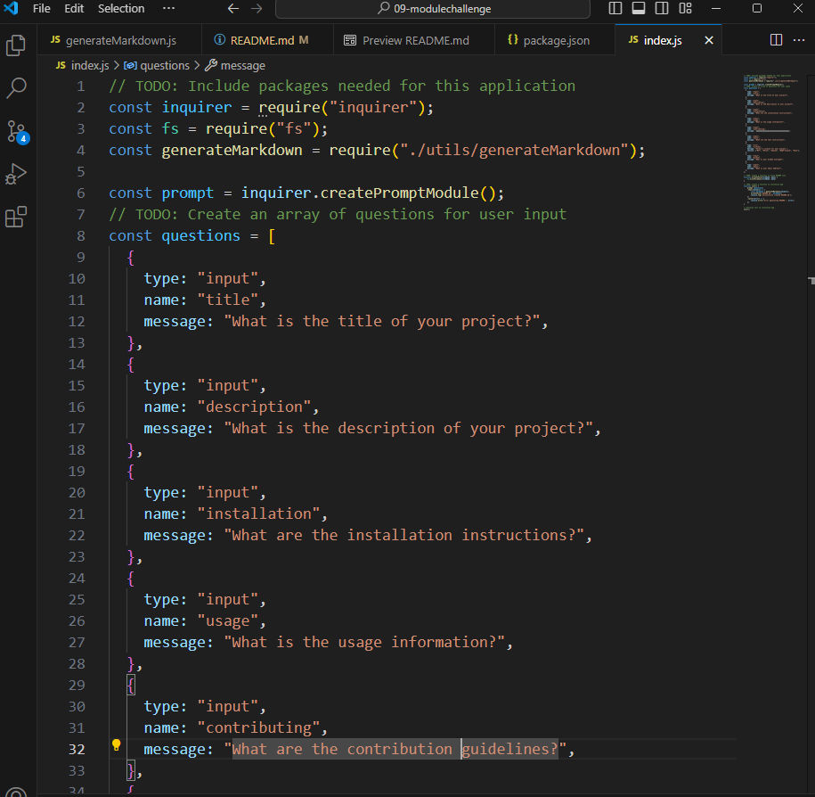
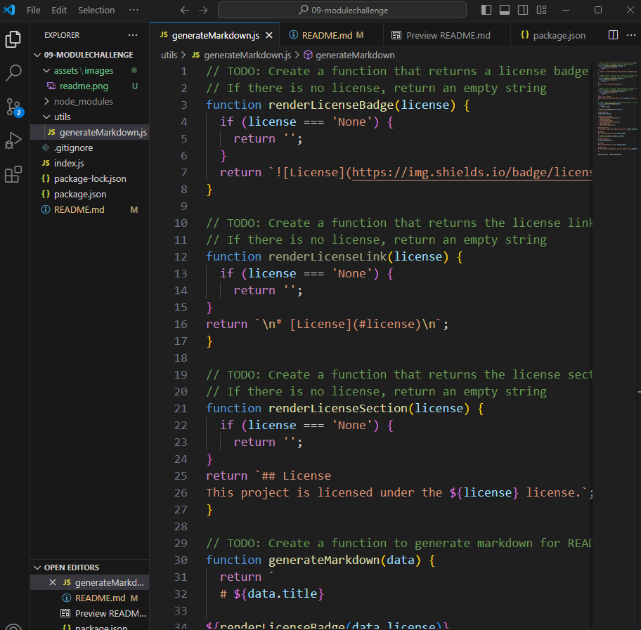

  # 09-Module Challenge: README Generator

## Description
This command-line application dynamically generates a professional README.md file based on user input. It allows developers to save time by automating the creation of detailed and structured README files for their projects.

## Table of Contents
- [Installation](#installation)
- [Usage](#usage)
- [License](#license)
- [Contributing](#contributing)
- [Tests](#tests)
- [Questions](#questions)

## Installation
To install, clone the repository and run npm install.

## Usage
Run the application using Node index.js.

## License
This project is licensed under the MIT license.

## Contributing
Welcome to Contribute! Fork the repository, create a new branch, and submit a pull request with your changes. Ensure your code adheres to the coding standards and is well-documented.

## Tests
Test the application using jest.

## Questions
If you have any questions, you can reach me at [annhargrove21@gmail.com](mailto:annhargrove21@gmail.com). You can also find more of my work at [agrove21](https://github.com/agrove21).

## Walkthrough Video
Watch the walkthrough video to see the application in action: [Watch Video](https://app.screencastify.com/v3/watch/neIoe02g8E5jmh6P12EC)

## Screenshots
### Index.js

### generateMarkdown.js
